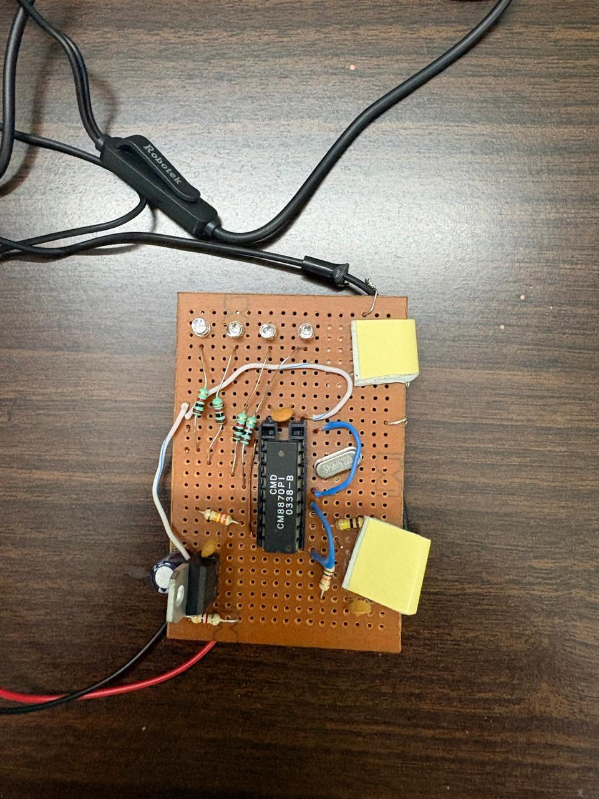
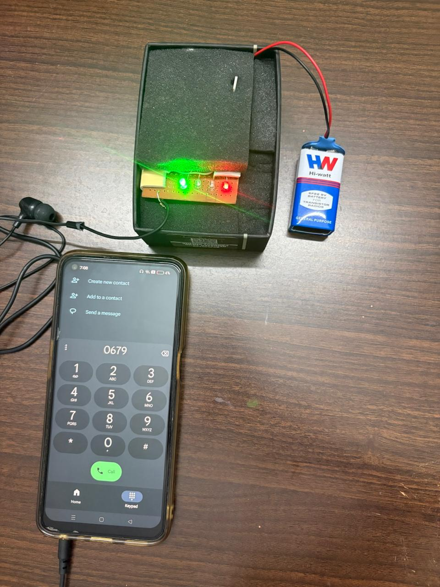

# DTMF Tone Decoder System

**M8870 DTMF Receiver IC displaying phone keypad digits in 8-4-2-1 binary format on LED indicators**

## Overview
A DTMF (Dual-Tone Multi-Frequency) decoder circuit using the M8870 DTMF Receiver IC that automatically 
detects and decodes phone keypad tones. The decoded symbol (0-9, asterisk *, hash #) is displayed in binary format using 
4 LEDs arranged in 8-4-2-1 weighted order. When any key is pressed on a phone, the M8870 identifies 
the tone and outputs the binary representation, which is then displayed on the LED indicators.
 
## How It Works

1. Phone keypad tone (DTMF signal) is input through signal conditioning stage
2. M8870 DTMF Receiver IC analyzes the incoming dual-tone signal
3. Steering circuit uses 330KΩ, 100KΩ resistors and 1N4148 diode to filter false triggers and validate the tone before output
4. Decoder identifies which tone was pressed (0-9, *,#)
5. Binary output generated on pins 11-14 (8-4-2-1 bit positions)
6. Output signals pass through current limiting resistors (4.7KΩ) to drive the LEDs
7. 4 LEDs light up showing the binary representation of the detected digit

## LED Binary Display (8-4-2-1 Encoding)
| Symbol | Pin 14 (8) | Pin 13 (4) | Pin 12 (2) | Pin 11 (1) | Binary |
|--------|-----------|-----------|-----------|-----------|--------|
| 0      | 0         | 0         | 0         | 0         | 0000   |
| 1      | 0         | 0         | 0         | 1         | 0001   |
| 2      | 0         | 0         | 1         | 0         | 0010   |
| 3      | 0         | 0         | 1         | 1         | 0011   |
| 4      | 0         | 1         | 0         | 0         | 0100   |
| 5      | 0         | 1         | 0         | 1         | 0101   |
| 6      | 0         | 1         | 1         | 0         | 0110   |
| 7      | 0         | 1         | 1         | 1         | 0111   |
| 8      | 1         | 0         | 0         | 0         | 1000   |
| 9      | 1         | 0         | 0         | 1         | 1001   |
| *      | 1         | 0         | 1         | 0         | 1010   |
| #      | 1         | 0         | 1         | 1         | 1011   |

**Example**: Press **9** on phone → M8870 decodes → Pins output 1001 → LEDs light: [ON, OFF, OFF, ON] 

## Key Components 

- **M8870** - DTMF Receiver/Decoder IC (core detection and decoding)
- **0.1µF Capacitor (104)** - AC coupling and signal conditioning at input
- **4 LEDs** - Red/Green arranged in 8-4-2-1 binary weighted order
- **1N4148 Diode, 330kΩ and 100kΩ** - filter false triggers and validate the tone before output
- **4.7kΩ Resistors** - LED current limiting resistors (4 resistors, one in series with each LED)
- **100kΩ Resistor(Input)** - Input impedance matching
- **3.579 MHz Crystal** - Timing reference for M8870 decoder
- **Power Supply** - +5V DC

## Design Specifications
- **DTMF Frequency Range**: Detects all standard DTMF tones (697–1633 Hz)
- **Decodable Symbols**: Digits 0-9, asterisk (*), hash (#)
- **M8870 Output**: 4 binary outputs (pins 11-14) representing detected symbol
- **LED Current Limiting**: 4.7kΩ resistors per LED for safe operation
- **Signal Conditioning**: Input impedance 100kΩ for phone line compatibility
- **Power Supply**: +5V regulated DC

## Applications
- Automatic phone tone recognition and symbol decoding (0-9, *, #)
- Telephone-based remote control systems
- Tone-based remote access systems
- DTMF signal monitoring and analysis
- Phone menu navigation systems
- Telephone keypad decoder for embedded systems

## Hardware Implementation 

Real PCB circuit implementation showing M8870 decoder IC, signal conditioning stage, steering circuit, current limiting resistors, and 4-LED binary display. Successfully decodes all standard phone keypad tones.

## Team Project
Group project completed as part of Integrated Circuits Lab.
Note: All team members contributed equally to design, implementation, testing, and documentation.
